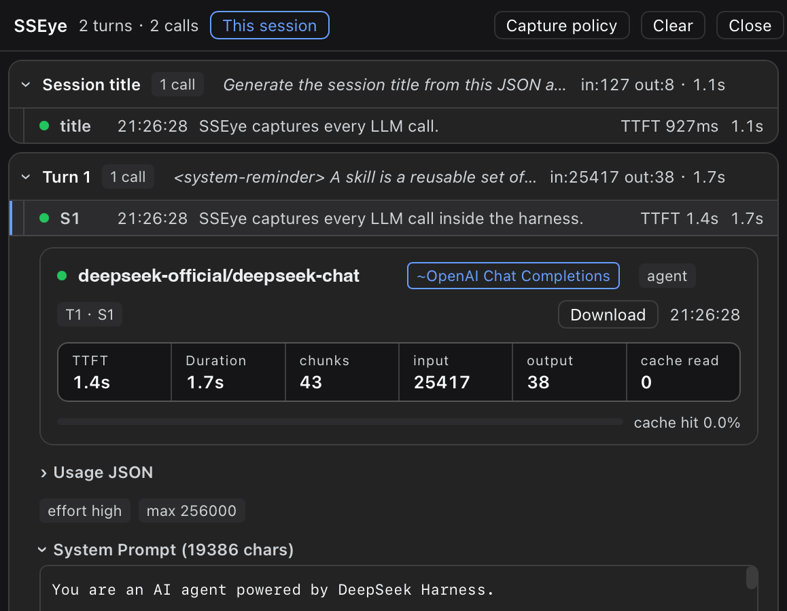
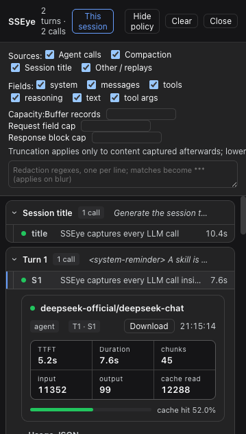

# dsh-sseye

> DeepSeek Harness 里的 LLM 调试台——每一次模型调用，全部内容，一目了然。

[English](README.md) | **简体中文**

`dsh-sseye` 是一个 DSH 插件：挂到 harness 原生的 `llm/stream` waterfall 上，捕获每次 LLM 调用的**完整内容**——全部 messages、system prompt、工具 schema、流式响应块、usage、真实协议与端点——再渲染成停靠在 harness 界面里的 DevTools 风格查看器。零代理、零证书、零额外配置，且自带完整 agent 语义：每条捕获都带 turn / step / 会话 / compaction 归因。

它是 [SSEye](#与-sseye-的关系) 在 harness 内部的兄弟项目——同一套诊断哲学，换个观察层。

<p>
  
  
</p>

## 安装

从 npm 安装（预构建——无需构建授权）：

```bash
dsh plugin --profile web add dsh-sseye
```

或直接从源码仓库安装：

```bash
dsh plugin --profile web add github:jhuanxx44/dsh-sseye
```

重启 harness，会话头部即出现 SSEye 按钮。（git 安装会执行包的 `prepare` 脚本构建；若 pnpm 因 build key 拦截就放行后重跑。`lib/` 预构建产物已提交，构建被拦也无碍。）

卸载：

```bash
dsh plugin --profile web remove dsh-sseye
```

## 配置

界面**默认为英文**。要切成中文（连同捕获内容里的截断标记），在 profile 的补丁层 `~/.dsh/profiles/<profile>/cordis.patch.yml` 里按 id 覆盖插件行配置：

```yaml
- id: sseye
  config:
    locale: zh-CN
```

改完重启 harness。任何以 `zh` 开头的值都选中文；其他值（或不配置）为英文。

## 已实现的功能

### 捕获 —— 全量、零侵入

- 每次调用完整的 `GenerateOptions`（system prompt、messages、工具 schema、采样参数）加响应流的每一个 chunk——在 `llm/stream` waterfall 处捕获并**原样放行**：chunk 的同一性、顺序、背压、取消与抛出的错误全部保持原样。
- 自带 agent 语义：调用经共享 `AbortSignal` 与 `agent/request` 的 turn/step 坐标关联，并按来源分类——agent 主循环 / compaction / 会话标题 / 其他。
- **真实协议与端点**（`openai-completions`、`anthropic-messages`、`google-generative-ai`……）从 provider 的 settings profile 解析；未声明协议的路由回退到猜测表，并用 `~` 明确标注。
- 时延与用量信号：TTFT、总时长、chunk 计数、含 cache-read 的 usage、finish reason、错误。
- 图片内容在捕获时省略（保留占位），其余内容全量捕获。

### 查看器 —— DevTools 风格，停靠在 harness 里

- **按 Turn 分组的列表**：同一轮的连续调用归入一个组头（聚合调用数、in/out token、总时长）；compaction / 标题 / 其他来源各自分组。可折叠。
- **步骤行**：状态点、步号、内容预览、TTFT / 时长 / usage——列变窄时指标渐进隐藏（container queries），内容永远优先。
- **内联手风琴详情**：点一行，完整详情就地在下方展开——单一滚动流，没有第二窗格。
- **详情视图**：顶部 hero（provider/model、协议 chip、端点、统计格与 **cache 命中率条**）、system prompt、messages、工具名、响应块（正文 / 推理 / 工具参数）、finish reason。
- **上下文 diff（第一形态）**：每次调用的 messages 与同会话上一次调用对比——共享前缀折叠成一次点击，只有新增消息高亮直出。
- **Wire JSON 重建**：镜像 DeepSeek adapter 的序列化——工具结果展开为独立的 `role:"tool"` 消息、推理在工具调用轮回放为 `reasoning_content`、reasoning effort 解析为 `thinking` 对象。
- 每个区块都有复制按钮；语法着色的 JSON 树，大数组/大对象原地展开。
- **JSON 导出**：单条（行悬停 / hero 按钮）或整组（bundle）；带版本号的自描述 payload。
- **流式实时视图**：调用进行中时只轮询并在打开的详情里合并「会变的字段」；空闲时退避，面板关闭或标签页隐藏时完全暂停。
- 本会话 / 全部过滤；一键清空。
- **中英双语界面**：默认英文，`config.locale: zh-CN` 切中文（见上文配置）。

面板停靠在 shell 右侧 details 列，接管该列（原工具详情面板在卸载后恢复）。[docs/harness-patches.md](docs/harness-patches.md) 有加宽该列的本地补丁。

### 抓取策略 —— 运行时可调

- **来源开关**（agent / compaction / 会话标题 / 其他）与**字段开关**（system / messages / tools / reasoning / 正文 / 工具参数）。省略在记录里如实标注（`N 条消息，按策略未捕获`），绝不无声留白。
- **脱敏**：正则列表，按策略变更预编译，**先脱敏再进缓冲**（`sk-…` → `***`）。
- **容量**：环形缓冲条数（默认 100，上限 5000）、请求字段截断、响应块截断——都钳制在合理边界内；调小缓冲立即裁掉最旧记录。
- 默认即全量捕获。策略面板收在查看器顶部，绝不挡路。

### 隐私姿态

默认全可见、**零持久化**。捕获住在有界的内存环形缓冲里，进程退出即焚毁。导出只发生在用户显式操作时。`llm/stream` 层永远看不到 API key（它们住在 adapter 内部），脱敏在进缓冲之前生效。

## 路线图

观察只是地基，差异化在后面：

- [ ] **Replay & Mutate** —— 克隆一条捕获的请求、改参数、经 `ctx.llm.stream()` 重新发出、并排比对响应。
- [ ] **语义 diff** —— 相邻调用之间超越共享前缀的变化分析。
- [ ] **Token 解剖** —— 逐消息的上下文成本拆解。
- [ ] **跨 subagent 扇出聚合**；路由（provider/model）过滤。

## 与 SSEye 的关系

| | SSEye | dsh-sseye |
|---|---|---|
| 观察点 | 网络层（mitmproxy） | harness 内部（`llm/stream` waterfall） |
| 看得见 | 机器上任何 SDK / 应用 | 仅 DSH 进程，但带完整 agent 语义 |
| 接入成本 | 代理 + CA 信任 | 一次插件安装 |

## 开发

```bash
pnpm install
pnpm build        # tsdown → lib/
pnpm test         # node --test
```

```
├── src/
│   ├── index.ts          # Host 半：llm/stream 捕获、环形缓冲、/__sseye/* HTTP 路由
│   └── client/           # Client 半：会话头部触发按钮 + details 列面板（React）
├── lib/                  # 已提交的构建产物（git 安装时由 `prepare` 重建）
├── docs/                 # 平台踩坑笔记 + 本地 harness 补丁
├── cordis.patch.yml      # bundle patch：向 profile 插入 `sseye` 插件行
└── tsdown.config.ts      # 客户端 bundle 契约
```

Host ↔ Client 走 `webServer` 服务上的同源 HTTP（`/__sseye/*`）。行为契约与架构不变量见 [AGENTS.md](AGENTS.md)；DSH 平台踩坑笔记见 [docs/prototype-field-notes.md](docs/prototype-field-notes.md)。

本地 checkout 安装：`dsh plugin --profile web add .`。发版走 tag 触发：改版本号 → commit → 打 `v*` tag → push tag。

## 许可

MIT
